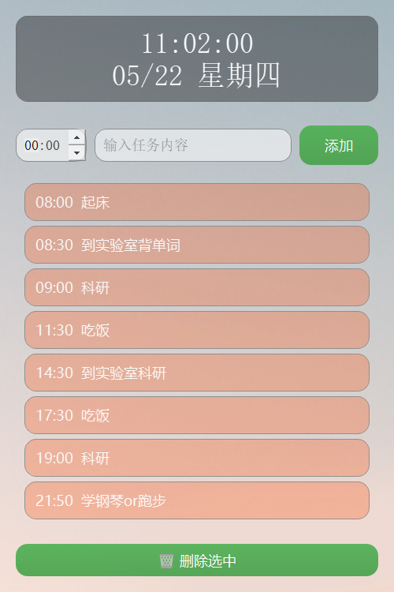
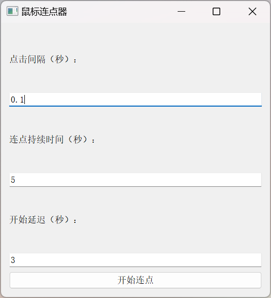

# QuickWork Tools

## 项目简介

**QuickWork Tools** 是一组自主开发的办公效率工具，旨在提升用户在日常任务处理过程中的操作效率与工作体验。

## WinTop —— 窗口置顶工具

**WinTop** 是基于 AutoHotKey 开发的窗口置顶辅助工具，可通过快捷键实现任意窗口的快速置顶与取消置顶操作。由于该工具开发时间较早，原始源码已遗失。

### 功能说明

- 使用快捷键 `Ctrl + 空格键` 可将当前窗口置顶；
- 再次按下 `Ctrl + 空格键` 可取消置顶状态。

### 下载链接

已打包版本可通过坚果云链接获取：  
[点击下载 WinTop](https://www.jianguoyun.com/p/DUgFaWMQ0Pi5DRjQ3PgFIAA)

## ToDoList 桌面任务管理工具

ToDoList 是基于 PyQt5 开发的桌面任务管理工具，具备半透明美观的界面设计和多项实用功能，旨在提升日常任务的管理效率。

### 功能说明

- 窗口半透明且圆角美观，支持拖拽移动，默认固定于屏幕右上角  
- 任务添加、删除与编辑，支持任务内容与时间的规范化输入  
- 任务列表支持拖拽排序，持久化保存至本地 JSON 文件  
- 支持任务到点弹窗提醒，提醒界面简洁醒目  
- 支持系统托盘图标，包含显示和退出快捷菜单  
- 快捷键支持：`Ctrl+N` 添加任务，`Ctrl+Del` 删除选中任务  
- 窗口默认常驻桌面但不抢占焦点，保持工作流畅

### 下载链接

已打包版本可通过坚果云链接获取：  
[点击下载 ToDoList](https://www.jianguoyun.com/p/DZDUkwsQ0Pi5DRjh3PgFIAA)

## AutoClick 连点器工具

AutoClick 是一款轻量级的鼠标自动连点工具，适用于需要频繁点击的场景，提升操作效率，减少重复劳动。

### 主要功能

- 支持用户自定义点击间隔（秒，支持小数）
- 支持设置连点持续时间，自动停止连点
- 支持设置开始前的延迟时间，便于切换窗口准备操作
- 操作界面简洁直观，易于使用

### 下载链接

已打包版本可通过坚果云链接获取：  
[点击下载 AutoClick](https://www.jianguoyun.com/p/DYBSN80Q0Pi5DRiY3PgFIAA)

## 开源协议

本项目遵循 [MIT License](https://opensource.org/licenses/MIT) 协议，欢迎自由使用与二次开发。
